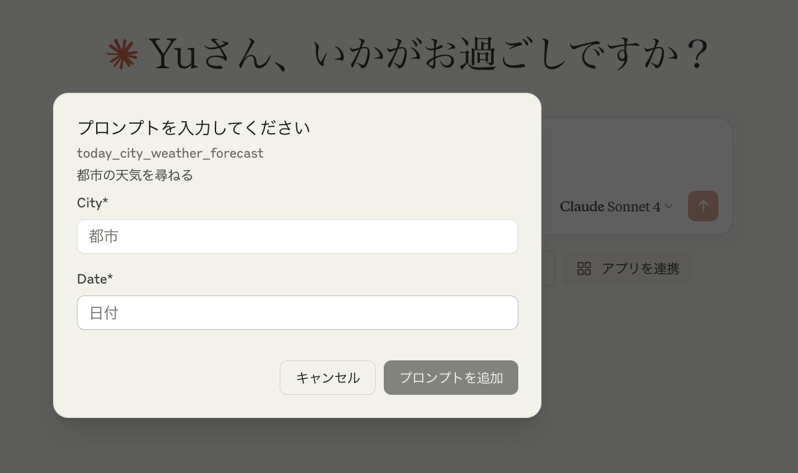
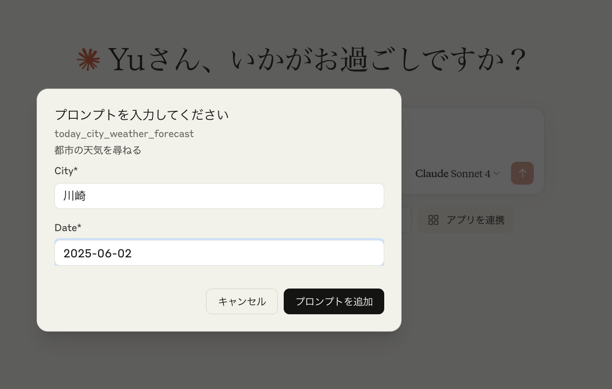
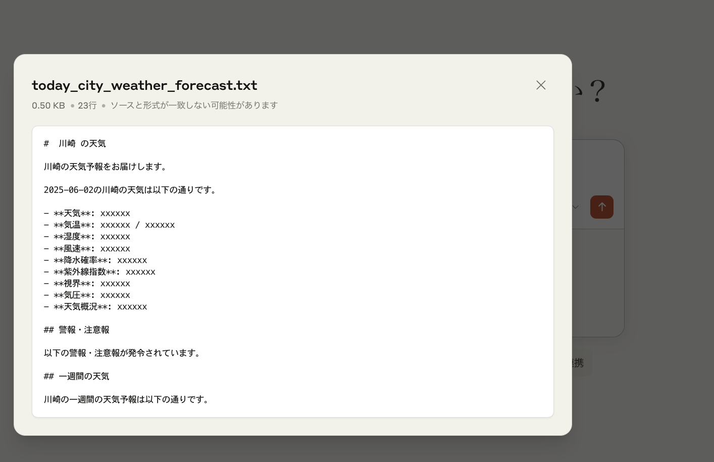
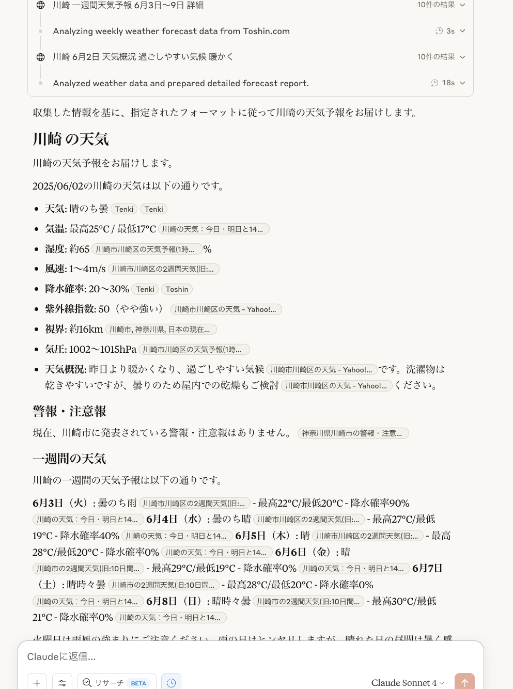

# MCP Prompt Templates Server

A Model Context Protocol (MCP) server that provides a "prompts" primitive for managing and serving customizable prompt templates. This server allows you to create, organize, and serve prompt templates that can be used by MCP clients for various tasks like meeting analysis, content summarization, and blog post creation.

## Features

- **Dynamic Template Loading**: Automatically loads prompt templates from the `templates` directory
- **YAML Configuration**: Each template uses YAML for configuration, making it easy to define metadata and parameters
- **Argument Support**: Templates support dynamic arguments that can be replaced at runtime
- **Type-Safe Implementation**: Built with TypeScript for improved reliability and developer experience
- **Standard MCP Prompts**: Implements the MCP prompts primitive, making it compatible with any MCP client

## Demo

This MCP server provides "prompts" that can be used directly in Claude Desktop. Here's how it works:

### 1. Viewing Available Prompts
When the MCP server is configured, you can see the list of available prompts by clicking "+" icon in Claude:



The server dynamically loads all templates from the `templates` directory and makes them available as prompts.

### 2. Using a Prompt
Select a prompt (e.g., `today_city_weather_forecast`) to see its required arguments:



Fill in the required fields:
- **City**: Enter the city name (e.g., "川崎" for Kawasaki)
- **Date**: Enter the date for the forecast (e.g., "2025-06-02")

### 3. Prompt Execution
After clicking "プロンプトを追加" (Add Prompt), the template is processed with your arguments:



The server replaces the placeholders in the template with your provided values and returns the formatted prompt.

### 4. Claude's Response
Claude then processes the generated prompt and provides a response based on the template's instructions:



In this example, Claude analyzes weather data and provides a detailed weather forecast for the specified city and date, following the format defined in the template.


## Installation

```bash
npm install
```

## Quick Start

1. Build the project:
   ```bash
   npm run build
   ```

2. Start the server:
   ```bash
   npm start
   ```

For development with hot-reloading:
```bash
npm run dev
```

## Creating Templates

Templates are organized in the `templates` directory. Each template requires:
- A directory with a descriptive name (e.g., `business_team_minutes_template`)
- A `config.yaml` file defining metadata and arguments
- A `template.md` file containing the prompt template

### Template Structure

```
templates/
└── your_custom_template/
    ├── config.yaml
    └── template.md
```

### Configuration Format (config.yaml)

```yaml
description: "A detailed description of what this template does"
version: "1.0"
arguments:
  - name: "argument_name"
    description: "Description of this argument"
    required: true
  - name: "optional_argument"
    description: "This argument is optional"
    required: false
metadata:
  tags:
    - tag1
    - tag2
  suggested_use: "When and how to use this template"
  output_format: "markdown"
```

### Template Format (template.md)

Templates use Mustache-style placeholders for arguments:

```markdown
# My Template

Date: {{ date }}
Title: {{ title }}

Content that uses the arguments provided by the user.
{{ main_content }}
```

## MCP Server Configuration

To use this server with an MCP client, add it to your MCP settings configuration.

### For Claude Desktop

Add to your Claude Desktop configuration file:

**macOS**: `~/Library/Application Support/Claude/claude_desktop_config.json`
**Windows**: `%APPDATA%\Claude\claude_desktop_config.json`

```json
{
  "mcpServers": {
    "prompt-templates": {
      "command": "node",
      "args": ["/path/to/mcp-prompt-templates-ts/dist/server.js"]
    }
  }
}
```

### For Development

During development, you can use tsx directly:

```json
{
  "mcpServers": {
    "prompt-templates": {
      "command": "npx",
      "args": ["tsx", "/path/to/mcp-prompt-templates-ts/src/server.ts"]
    }
  }
}
```

## Development

### Project Structure

```
mcp-prompt-templates-ts/
├── src/
│   ├── server.ts    # Main MCP server implementation
│   └── client.ts    # Test client for development
├── templates/       # Prompt templates directory
├── dist/           # Compiled JavaScript output
├── package.json
├── tsconfig.json
└── README.md
```

### Adding New Templates

1. Create a new directory in `templates/`
2. Add a `config.yaml` file with the template configuration
3. Add a `template.md` file with the prompt template
4. Restart the server to load the new template

## API Reference

This server implements the MCP prompts primitive with the following handlers:

### List Prompts
Returns all available prompt templates with their metadata.

### Get Prompt
Retrieves a specific prompt template and replaces arguments with provided values.

**Parameters:**
- `name`: The template name (directory name)
- `arguments`: Object containing argument values to substitute

## Contributing

1. Fork the repository
2. Create a feature branch (`git checkout -b feature/new-template`)
3. Add your template or improvements
4. Commit your changes (`git commit -am 'Add new template'`)
5. Push to the branch (`git push origin feature/new-template`)
6. Create a Pull Request

## License

MIT License - see LICENSE file for details

## Troubleshooting

### Server not loading templates
- Ensure templates directory exists and contains valid subdirectories
- Check that each template has both `config.yaml` and `template.md` files
- Verify YAML syntax in configuration files

### Template arguments not replacing
- Ensure argument names in template match those defined in config.yaml
- Use the correct placeholder syntax: `{{ argument_name }}`
- Check that required arguments are provided when calling the prompt

## Support

For issues, questions, or contributions, please visit the [GitHub repository](https://github.com/tubone24/mcp-prompts).